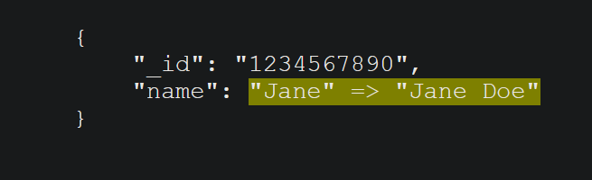

# mongotrace

Mongo trace is a simple tool who help you to track and save operations performed on your Mongo Database.

# Usage

This is just a quick introduction.

Let's start with a trivial example:

```go
package main

import (
	"context"
	"fmt"
	"go.mongodb.org/mongo-driver/mongo"
	"go.mongodb.org/mongo-driver/mongo/bson"
	"go.mongodb.org/mongo-driver/mongo/options"
	"go.mongodb.org/mongo-driver/mongo/readpref"
	"log"
)

type Person struct {
	ID   string `json:"_id" bson:"_id"`
	Name string `json:"name" bson:"name"`
}

func main() {
	ctx := context.TODO()
	clientOptions := options.Client().ApplyURI("mongodb://localhost:27017")
	client, err := mongo.Connect(ctx, clientOptions)
	if err != nil {
		log.Fatal(err)
	}
	err = client.Ping(ctx, readpref.Primary())
	if err != nil {
		log.Fatal(err)
	}

	db := client.Database("Test")

	// Create our first record
	initialRecord := Person{
		ID:   "1234567890",
		Name: "Jane",
	}
	_, err = db.Collection("Person").InsertOne(ctx, initialRecord)
	if err != nil {
		log.Fatal(err)
	}
	
	// Now we update our first record
	filter := bson.M{"_id": initialRecord.ID}
	_, err = db.Collection("Person").UpdateOne(ctx, filter, bson.M{"$set": bson.M{"name":"Jane Doe"}})
	if err != nil {
		log.Fatal(err)
	}

	trace, err := TraceOperationUpdateWithFilter(db, "Trace", "Person", initialRecord, filter)
	if err != nil {
		log.Fatal(err)
	}
	
	
	fmt.Println(trace.Difference)
}
```

This output in a html "pre" tag will be will be



# Avialable func

```go
mongotrace.TraceOperationAdd()
mongotrace.TraceOperationDelete()
mongotrace.TraceOperationUpdate()
mongotrace.TraceOperationUpdateWithFilter()
```